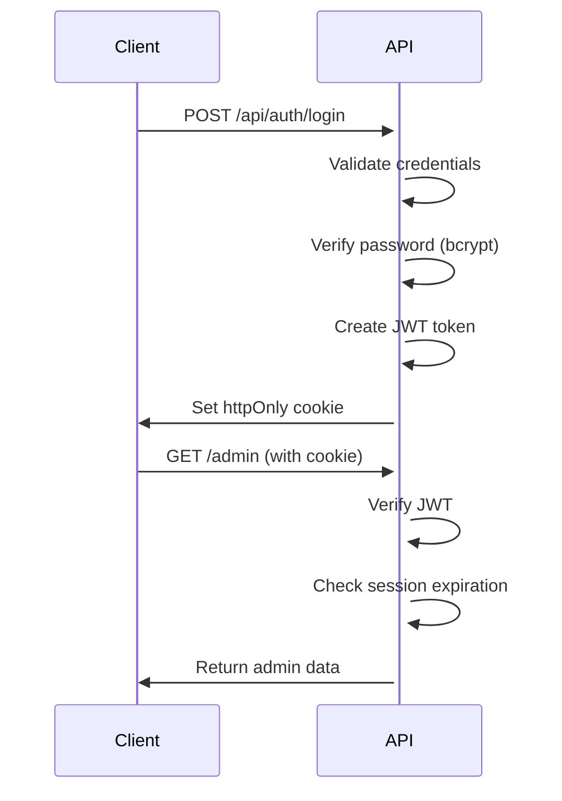

# Security Documentation

## Overview

This application follows **security-first design principles** based on OWASP guidelines and industry best practices. This document outlines our security architecture, controls, and procedures.

---

## Table of Contents

1. [Security Architecture](#security-architecture)
2. [Authentication & Authorization](#authentication--authorization)
3. [Input Validation](#input-validation)
4. [Security Headers](#security-headers)
5. [Rate Limiting](#rate-limiting)
6. [Audit Logging](#audit-logging)
7. [Secure Configuration](#secure-configuration)
8. [Threat Model](#threat-model)
9. [Security Checklist](#security-checklist)
10. [Incident Response](#incident-response)

---

## Security Architecture

### Defense in Depth

We implement multiple layers of security controls:

```
┌─────────────────────────────────────────────────┐
│  Layer 1: Network (HTTPS, HSTS, CSP)           │
├─────────────────────────────────────────────────┤
│  Layer 2: Application (Auth, Rate Limiting)    │
├─────────────────────────────────────────────────┤
│  Layer 3: Input Validation (Zod Schemas)       │
├─────────────────────────────────────────────────┤
│  Layer 4: Output Encoding (Sanitized Errors)   │
├─────────────────────────────────────────────────┤
│  Layer 5: Logging & Monitoring (Audit Logs)    │
└─────────────────────────────────────────────────┘
```

### Security Modules

| Module | Location | Purpose |
|--------|----------|---------|
| Environment Validation | `src/config/env.ts` | Validates env vars at startup |
| Security Headers | `src/infra/security/headers.ts` | CSP, HSTS, X-Frame-Options |
| Authentication | `src/infra/security/auth.ts` | JWT sessions, password verification |
| Rate Limiting | `src/lib/security.ts` | Brute force protection |
| Audit Logging | `src/lib/security.ts` | Security event logging |
| Input Validation | `src/infra/http/responses.ts` | Zod schema validation |

---

## Authentication & Authorization

### Admin Authentication Flow



### Session Management

**JWT Configuration**:
- **Algorithm**: HS256 (HMAC with SHA-256)
- **Secret**: Minimum 32 characters (validated at startup)
- **Expiration**: 24 hours
- **Storage**: httpOnly, secure, sameSite cookies

**Session Payload**:
```typescript
{
  userId: string;
  role: 'admin';
  issuedAt: number;    // Unix timestamp
  expiresAt: number;   // Unix timestamp
}
```

**Security Features**:
- ✅ Secure cookie flags (httpOnly, secure in production, sameSite)
- ✅ Token expiration enforced
- ✅ Password hashing with bcrypt (cost factor: 10)
- ✅ Timing-safe password comparison
- ✅ Failed login tracking and account lockout

### Password Requirements

Passwords must meet the following criteria:

- Minimum 12 characters
- At least one uppercase letter
- At least one lowercase letter
- At least one number
- At least one special character
- Not in common password list

**Validation**: `src/lib/security.ts::validatePasswordStrength()`

---

## Input Validation

### Validation Strategy

All inputs are validated using **Zod schemas** before processing.

#### API Request Validation

```typescript
// Example: Validate login request
const loginSchema = z.object({
  password: z.string().min(1, 'Password is required'),
});

const body = await validateRequestBody(request, loginSchema);
```

#### Content File Validation

```typescript
// Example: Validate SIEM events
const siemEventsSchema = z.array(securityEventSchema);

const events = loadContent('siem/events.json', siemEventsSchema);
```

### Sanitization

User inputs are sanitized to prevent XSS:

```typescript
export function sanitizeInput(input: string): string {
  return input
    .replace(/[<>]/g, '')           // Remove < and >
    .replace(/javascript:/gi, '')   // Remove javascript: protocol
    .replace(/on\w+=/gi, '')        // Remove event handlers
    .trim();
}
```

**Note**: We rely primarily on CSP headers and React's built-in XSS protection. Sanitization is a defense-in-depth measure.

---

## Security Headers

### Content Security Policy (CSP)

**Directive** | **Value** | **Purpose**
-------------|-----------|------------
`default-src` | `'self'` | Default policy: only same-origin resources
`script-src` | `'self' 'unsafe-inline' 'unsafe-eval'` | Allow scripts from same origin (unsafe-eval required for Next.js dev)
`style-src` | `'self' 'unsafe-inline'` | Allow styles (unsafe-inline required for Tailwind)
`img-src` | `'self' data: https:` | Allow images from same origin, data URIs, and HTTPS
`font-src` | `'self' data:` | Allow fonts from same origin and data URIs
`connect-src` | `'self' https://formspree.io https://api.github.com` | Allow API calls to trusted domains
`frame-ancestors` | `'none'` | Prevent clickjacking
`base-uri` | `'self'` | Restrict base tag to same origin
`form-action` | `'self'` | Restrict form submissions to same origin

### Other Security Headers

**Header** | **Value** | **Purpose**
-----------|-----------|------------
`X-Frame-Options` | `DENY` | Prevent clickjacking (legacy support)
`X-Content-Type-Options` | `nosniff` | Prevent MIME type sniffing
`X-XSS-Protection` | `1; mode=block` | Enable browser XSS filter (legacy)
`Referrer-Policy` | `strict-origin-when-cross-origin` | Control referrer information
`Permissions-Policy` | `geolocation=(), microphone=(), camera=()` | Disable unnecessary features
`Strict-Transport-Security` | `max-age=31536000; includeSubDomains; preload` | Force HTTPS (production only)

### Implementation

Headers are applied globally via middleware:

```typescript
// src/middleware.ts
export function middleware(request: NextRequest) {
  const response = NextResponse.next();
  const headers = getSecurityHeaders({ environment: 'production' });

  headers.forEach((value, key) => {
    response.headers.set(key, value);
  });

  return response;
}
```

---

## Rate Limiting

### Rate Limit Configuration

**Endpoint** | **Limit** | **Window** | **Block Duration**
-------------|-----------|------------|-------------------
Admin Login | 5 attempts | 15 minutes | 30 minutes
Login by IP | 10 attempts | 15 minutes | 1 hour
General API | 100 requests | 1 minute | N/A

### Implementation

```typescript
// src/lib/security.ts
export const loginRateLimiter = new RateLimiterMemory({
  points: 5,              // Number of attempts
  duration: 15 * 60,      // Per 15 minutes
  blockDuration: 30 * 60, // Block for 30 minutes
});
```

### Failed Login Tracking

```typescript
// After 5 failed attempts within 15 minutes
if (failedAttempts >= 5) {
  blockedUntil = now + 30 minutes;
}
```

---

## Audit Logging

### Event Types Logged

- ✅ Admin login attempts (success and failure)
- ✅ Admin actions (SIEM event edits, rule changes)
- ✅ API authentication failures
- ✅ Rate limit violations

### Audit Log Format

```typescript
{
  timestamp: "2025-12-29T12:00:00Z",
  event: "admin_login",
  ip: "192.0.2.1",
  userAgent: "Mozilla/5.0...",
  success: true,
  details: "User admin logged in successfully"
}
```

### Log Retention

- **In-Memory**: Last 1,000 events
- **Console**: All events (for production log aggregation)
- **Future**: Database persistence for long-term retention

### Accessing Audit Logs

```http
GET /api/admin/audit-logs
Authorization: Bearer <admin-session-token>
```

---

## Secure Configuration

### Environment Variables

All environment variables are validated at startup:

```typescript
// config/env.ts
const serverEnvSchema = z.object({
  JWT_SECRET: z.string().min(32),
  ADMIN_PASSWORD_HASH: z.string().min(1),
  NODE_ENV: z.enum(['development', 'production', 'test']),
});
```

**Critical Variables**:
- `JWT_SECRET`: Minimum 32 characters, cryptographically random
- `ADMIN_PASSWORD_HASH`: Bcrypt hash of admin password
- `NODE_ENV`: Controls security features (HSTS, etc.)

### Secrets Management

✅ **DO**:
- Store secrets in `.env` (never committed to git)
- Use strong, randomly generated secrets
- Rotate secrets periodically
- Use different secrets per environment

❌ **DON'T**:
- Commit `.env` to version control
- Use default/example secrets in production
- Expose secrets in client-side code
- Hard-code secrets in source code

### Secret Generation

```bash
# Generate JWT secret (256-bit)
node -e "console.log(require('crypto').randomBytes(32).toString('hex'))"

# Generate admin password hash
node -e "const bcrypt = require('bcryptjs'); console.log(bcrypt.hashSync('your-secure-password', 10));"
```

---

## Threat Model

### Assets

1. **Admin Session Tokens** (High Value)
2. **User Data** in content files (Medium Value)
3. **Application Integrity** (High Value)

### Threats

| Threat | Likelihood | Impact | Mitigation |
|--------|------------|--------|------------|
| Brute Force Login | Medium | High | Rate limiting, account lockout |
| Session Hijacking | Low | High | httpOnly cookies, secure flags |
| XSS Injection | Low | Medium | CSP headers, React escaping |
| CSRF Attacks | Low | Medium | SameSite cookies, CSRF tokens |
| SQL Injection | N/A | N/A | No SQL database (file-based) |
| DoS Attack | Medium | Medium | Rate limiting, CDN (future) |

### STRIDE Analysis

**Component**: Admin Authentication

- **Spoofing**: Mitigated by bcrypt password hashing
- **Tampering**: Mitigated by JWT signature verification
- **Repudiation**: Mitigated by audit logging
- **Information Disclosure**: Mitigated by secure cookies, error sanitization
- **Denial of Service**: Mitigated by rate limiting
- **Elevation of Privilege**: Mitigated by role-based access control

---

## Security Checklist

### Deployment Checklist

- [ ] Set strong `JWT_SECRET` (min 32 chars)
- [ ] Set `ADMIN_PASSWORD_HASH` with bcrypt
- [ ] Set `NODE_ENV=production`
- [ ] Enable HTTPS (e.g., via Vercel/Netlify)
- [ ] Verify security headers in production
- [ ] Test rate limiting
- [ ] Review CSP policy
- [ ] Set up log aggregation
- [ ] Configure backup for content files
- [ ] Test admin login flow
- [ ] Verify session expiration

### Code Review Checklist

- [ ] All inputs validated with Zod
- [ ] No secrets in source code
- [ ] Error messages sanitized
- [ ] Security headers applied
- [ ] Authentication required for admin routes
- [ ] Audit logging for sensitive actions
- [ ] Rate limiting on authentication endpoints
- [ ] No SQL injection vectors (N/A for this app)
- [ ] XSS protection via CSP
- [ ] CSRF protection via SameSite cookies

### Monthly Security Review

- [ ] Review audit logs for anomalies
- [ ] Check for dependency vulnerabilities (`npm audit`)
- [ ] Update dependencies
- [ ] Rotate JWT secret
- [ ] Review failed login attempts
- [ ] Test disaster recovery procedures

---

## Incident Response

### Suspected Breach

1. **Immediate Actions**:
   - Rotate `JWT_SECRET` immediately
   - Invalidate all sessions
   - Review audit logs
   - Change admin password

2. **Investigation**:
   - Check for unauthorized access in logs
   - Review recent code changes
   - Scan for malware/backdoors
   - Check for data exfiltration

3. **Recovery**:
   - Patch vulnerabilities
   - Restore from backup if needed
   - Notify users (if applicable)
   - Document incident

### Failed Login Spike

1. Check if it's a legitimate user (forgot password)
2. Verify rate limiting is working
3. Check source IPs (potential botnet)
4. Consider temporary IP blocking
5. Review password policy

### Dependency Vulnerability

1. Run `npm audit`
2. Review CVE details
3. Update vulnerable dependency
4. Test application
5. Deploy fix immediately
6. Document in changelog

---

## Compliance

### OWASP Top 10 (2021)

| Risk | Status | Controls |
|------|--------|----------|
| A01: Broken Access Control | ✅ Mitigated | JWT auth, session validation |
| A02: Cryptographic Failures | ✅ Mitigated | Bcrypt, secure cookies |
| A03: Injection | ✅ Mitigated | Zod validation, no SQL |
| A04: Insecure Design | ✅ Mitigated | Security-first architecture |
| A05: Security Misconfiguration | ✅ Mitigated | Env validation, secure defaults |
| A06: Vulnerable Components | ⚠️ Ongoing | Regular `npm audit`, updates |
| A07: Authentication Failures | ✅ Mitigated | Rate limiting, strong passwords |
| A08: Data Integrity Failures | ✅ Mitigated | JWT signatures, file integrity |
| A09: Logging Failures | ✅ Mitigated | Audit logging implemented |
| A10: SSRF | ✅ Mitigated | No server-side requests to user URLs |

---

## Security Contact

For security concerns, please:

1. **Do NOT** create public issues for security vulnerabilities
2. Email security concerns to: [your-email]
3. Include detailed information about the vulnerability
4. Allow reasonable time for fix before disclosure

---

*Last Updated: December 29, 2025*
*Security Version: 1.0*
